.. toctree::
   :titlesonly:

=============================
Appleseed Base Installation
=============================

.. contents:: Table of Contents

You can download the Appleseed Base application files from `<https://github.com/Appleseed/base>`_

Appleseed Base Engine Configuration
-------------

This section explains how to configure Appleseed Base Engine Console to provide it with a list of sources or connectors and search endpoints.

* Basic configuration is in the `app.config` file.

	* Most user-defined configuration options will be under the appSettings section.
	
		* Key ExitAfterRun value can be "true" or "false".
			
			* Setting to "true" will close the Console after the run has completed.

		* Key ReadConfigFrom value can be either "config", "cassandra", or "datastax".

			* Setting to "config" will read the list of sources to be indexed by the Base Engine from `/config/engine.map.xml` and `/config/engine.process.xml`
			* Setting to "cassandra" or "datastax" will read the list of sources to be indexed by the Base Engine from a Cassandra database.  See related configuration keys below.

		* Key CassandraUrl value is used when ReadConfigFrom is "cassandra", or "datastax". 

			* CassandraUrl is the URL or IP of the Cassandra server.

		* Key CassandraPort value is the open port to the Cassandra server.  

			* Default is "9042".

		* Key OpenCalaisApiKey value is the API key for Open Calais.

			* Value should be your Open Calais API key.
			* This key allows Open Calais to add keyword tags to items processed by the Base Engine.

		* Key AlchemyApiKey value is the API key for Alchemy.

			* Value should be your Alchemy API key.
			* This key allows Alchemy to add keyword tags to items processed by the Base Engine.

* The list of Base Engine processes that get run is configured in `/config/engine.process.xml`.

	* The Indexes process allows content collected by the Base Engine to be pushed to the configured endpoints.

	* SortOder and Enabled are the only properties of a process that should be edited.

		* The template engine.process.xml file has a list of processes that run in accordance to the value of SortOrder.
		* Enabled value should be set to "true" if you wish to allow the Base Engine to run that particular process.

* The list of sources to be indexed by the Base Engine is configured in either `/config/engine.process.xml` or inside a Cassandra database.

	* Setting app.config key ReadConfigFrom to be "config" will read the configuration from `/config/engine.process.xml`.

		* The IndexesSectionCfg contains a list of index endpoints to which data collected by the Base Engine will be stored.  Potential endpoints are Lucene, Solr, and ElasticSearch.

	* Setting app.config key ReadConfigFrom to be "cassandra" or "datastax" will read the configuration from a Cassandra database, appleseed_search_engines.

		* The database can be set up by executing the contents of `/config/appleseed_schema.cql` inside a Cassandra cluster via CQLSH.

		* The database can be populated with some default configuration options and sources by executing the contents of `/config/base.engine.data.cql` inside a Cassandra cluster via CQLSH.

		* The table appleseed_search_engines.config, where config_type is "index" (config_name Search.Index), contains a list of index endpoints to which data collected by the Base Engine will be stored.  Potential endpoints are Lucene, Solr, and ElasticSearch.	

Appleseed Base Engine for Solr Endpoint Alias 
-------------

This section explains how to configure Appleseed Base Engine for a Solr 4 or Solr 5 Endpoint

* Use Remote Desktop Connection to connect to the client's Search Server.
* Install Java JRE (newest) on this server if it's not already there.
* Solr4 & Solr5 are supported.  The below example uses Solr4.  Solr6 support is in development.
* Export the ``Services/Appleseed.Search`` folder from an internal source into the ``C:\Services\Appleseed.Search`` directory of the site.

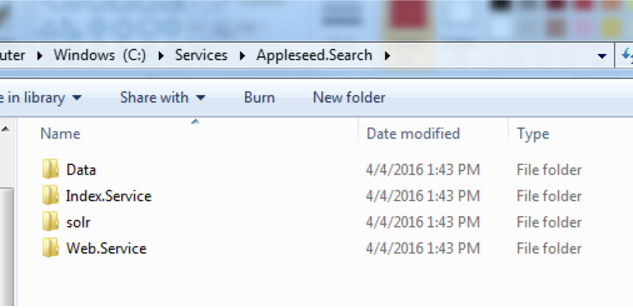

* Export and Extract the latest IndexService.zip file from the ``Binaries/Appleseed.Search`` folder from an internal source into the ``C:\Services\Appleseed.Search\Index.Service`` directory created earlier.

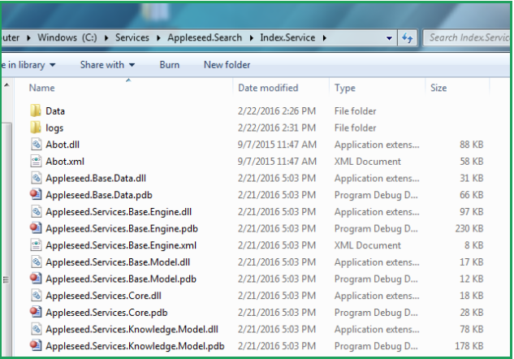

* Export and Extract your chosen Solr Verson ( 4 or 5 ) file from the Apache Mirror http://lucene.apache.org/solr/mirrors-solr-latest-redir.html into the ``C:\Services\Appleseed.Search\solr\<solr_install_directory>`` directory created earlier.

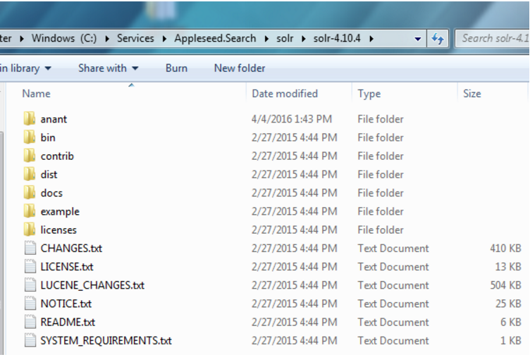

* Copy the Appleseed Search Solr Configuration directory

   * Copy.the ``\solr\solr-4.10.4\anant\appleseed-search`` directory into the ``.\solr\solr_install_directory\example`` directory of the Solr installation.

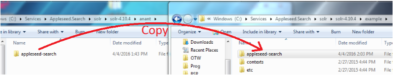

* Start the Solr Service. 

    * Open Windows PowerShell and run as administrator. Start Solr by inputting this script: ``bin\solr start -f -p 8983 -s example\appleseed-search\solr -V``. 
    * Make sure you are in the ``C:\Services\Appleseed.Search\solr\<solr_install_directory>`` directory when you run it.

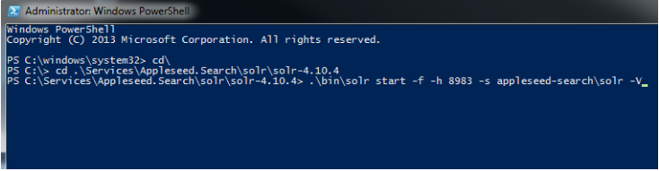

* (Windows Only) Install Solr as a service on the Server using PowerShell run as Administrator.
	
	* Install NSSM using chocolatey 
	* Command to enter into PowerShell: 
	* cinst nssm
	* Install service with NSSM: ``nssm install <Title of Service> (i.e nssm install Solr5)``
	* In the first panel that come up input the following 3 items:
	* ``Path : C:\Services\Appleseed.Search\solr\solr_install_directory\bin\solr.cmd``
	* ``Startup Directory : C:\Services\Appleseed.Search\solr\<solr_install_directory>``
	* ``Arguments: start -f -p 8983 -s appleseed-search\solr -V``
	* Click on the Details tab and enter these items:
	* ``Display Name : Solr ( Version Number )``
	* ``Description: Appleseed Search - Solr ( Version Number )``
	* Make sure the Startup Type is set to Automatic.
	* Click on the Install Service button toward the lower right. 
	* If you need to edit the info above after the service is installed the command is: ``nssm edit <Title of Service>``
	* Go to Control Panel => Administrative Tools and click on the Services shortcut.
	* Scroll down to the name of the service ``(“<Title of Service> (i.e Solr5)”)``, double click on it and Start it. 

* Verify Appleseed public and private are on the Solr server.

    * Open a browser on the server and go to localhost:8983/solr, and check that it brings up the Solr Admin panel. 

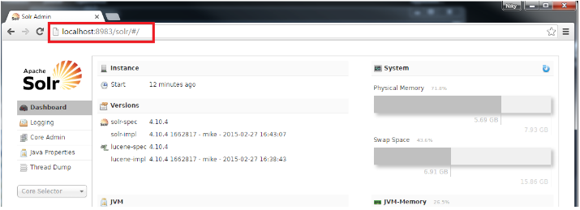

    * If there is an error, check the ``C:\Services\Appleseed.Search\solr\solr-4.10.4\example\appleseed-search\solr\appleseed-public\data\index`` folder, and delete any write.lock file if there is one.

* Configure or merge index service configuration (XML file) to point to the SolR Endpoint  (indexalias) (http:/localhost:8983/solr).

    * ``C:\Services\Appleseed.Search\Index.Service\Appleseed.Services.Search.Console.exe.config`` (XML FILE)

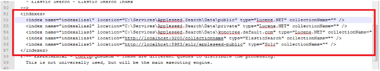

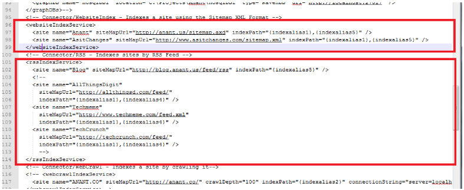

* Run the Index Service by double-clicking/clicking on it. ``(C:\Services\Appleseed.Search\Index.Service\Appleseed.Services.Search.Console.exe)``

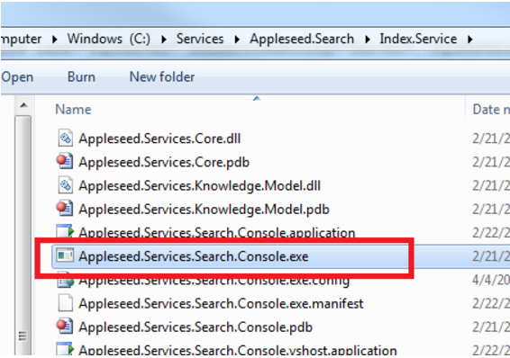

* Verify the data imported by open a browser and go to ``http://localhost:8983/solr`` to access the Solr app panel.

    * From the Index Selector dropdown in the left sidebar, select the appleseed-public collection, click on the Query tab, make sure *:* is in the “q” window, and click the Execute Query button. Check that “numFound” under “response” gives you the number you expect.

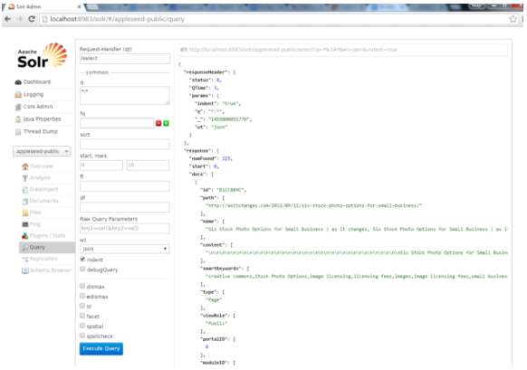

* To reindex the data to point to a different set: 
	1. Update the ``C:\Services\Appleseed.Search\Index.Service\Appleseed.Services.Search.Console.exe.config`` (XML FILE) as necessary.
	
		* Add or update index aliases between the <indexes> tags
		
		.. image:: ../images/Seventh-Step.PNG	
	
		* Add or edit sites between the <websiteIndexService> or <rssIndexService> tags when updating website or RSS feed sources, respectively.  You may also wish to edit the aliases used for each site by updating the indexPath attribute.  You may use more than one alias per site to get multiple search endpoints.
		
		.. image:: ../images/Eighth-Step.PNG

	2. In the Solr panel left sidebar, click on the Documents tab. 
	3. Set the Document Type to XML. 
	4. Enter in the “Document(s)” field ``<delete><query>*:*</query></delete><commit/>`` and click Submit Document.
	
	.. image:: ../images/Ten-Point-Five-Step.PNG
	
	* Alternative to step 4: 
		* Open a browser and enter into the URL bar: 
				``http://localhost:8983/solr/appleseed-public/update?stream.body=<delete><query>*:*</query></delete>`` and hit enter.
		* Once a success message is returned enter into the URL bar: 
				``http://localhost:8983/solr/appleseed-public/update?stream.body=<commit/>``.

	
	5. Click on the Query tab and run a ``*:*`` query to check that the numfound is 0. 
	6. Run the Index Service again by double-clicking/clicking on it **as an admin** or you might get file permission issues.  This file should be ran in Powershell if available rather than simply double clicked on. ``(C:\Services\Appleseed.Search\Index.Service\Appleseed.Services.Search.Console.exe)``.

	* Alternative to step 6, you may use Luke instead of Solr.
		After downloading Luke from https://github.com/DmitryKey/luke/releases/tag/luke-4.10.4, Run luke.sh to open the apps. Direct Path directory the location of index files ``C:\Services\Appleseed.Search\Data\Public`` and hit OK.
	
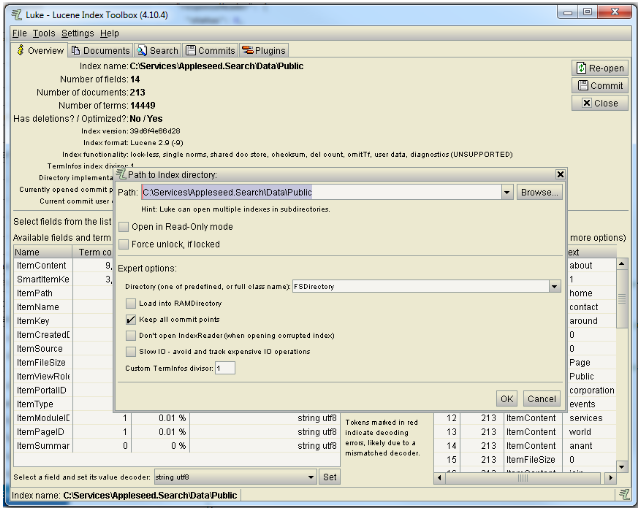

* Set up windows task scheduler to Run Index

    * Open Server Manager > Configuration > Task Scheduler >  Create Basic Task…

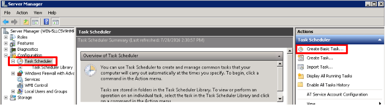

    * Fill it with neccesary info as follows.
    
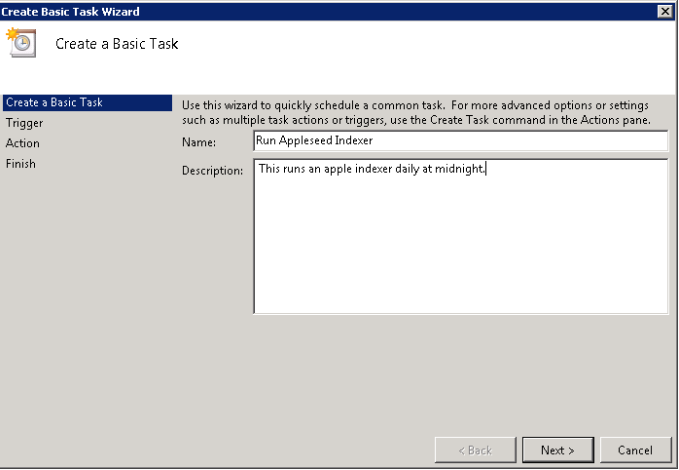

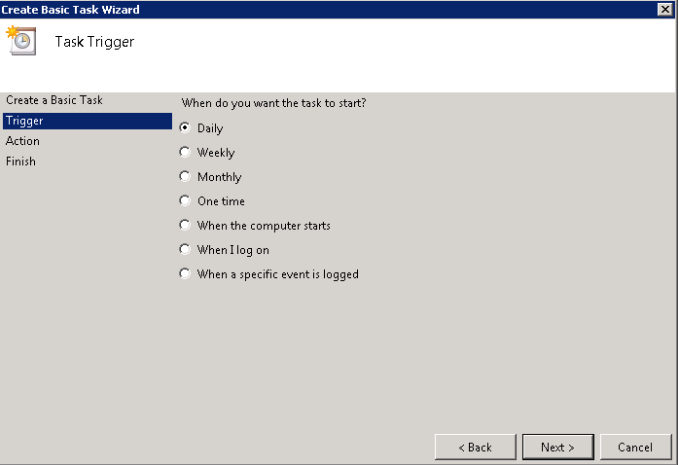

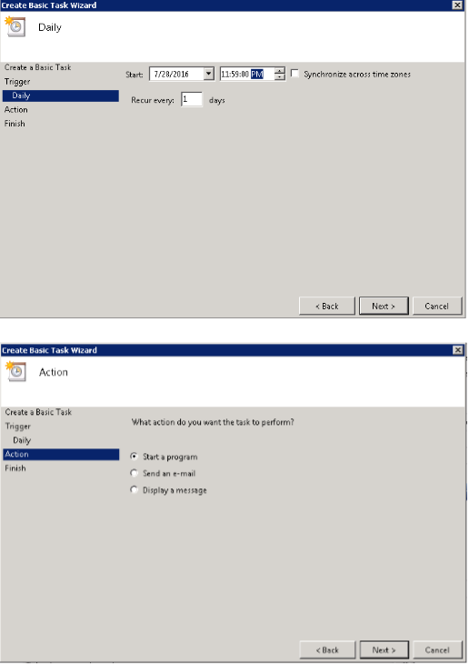

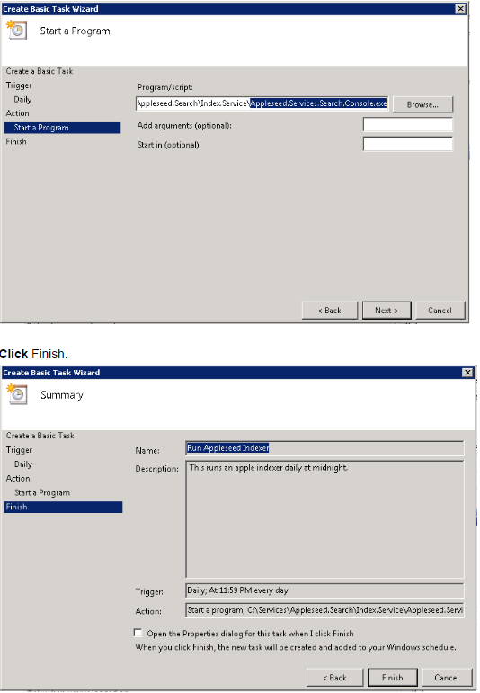

* Set up Windows Search Web Server.

    * Install URL Redirect 2.0 from Microsoft
    
    * Create a Thin Microsoft.NET Web Site & Application pool in IIS and configure the web.config as follows ::

	<?xml version="1.0" encoding="UTF-8"?>
	<configuration>
	  <system.webServer>
             <rewrite>
		<rules>
		   <rule name="ReverseProxyInboundRule1" stopProcessing="true">
		    <match url="^solr/select(.*)" />
	            <action type="Rewrite" url="http://localhost:8983/solr/appleseed-public/select{R:1}" />
		    </rule>
		 </rules>
              </rewrite>
	  </system.webServer>
	</configuration>

* Install latest Angular.js interface (Search.Web.User.Ng/app) on the Indexing Server (http:/api.domain-name.com/app). 
* Start Solr proxy on IIS. 
* Test API with Angular.js interface. 
* Clean up old data from Solr.
* Configure the ``Search.Web.User.Ng\app\js\solr-ajax\app\documents.js`` file to point to the Reverse Proxy (http://api.domain-name.com/solr/).
* Verify data on Solr. 
* Verify data on Angular.js interface.

.. include:: /././common.txt

