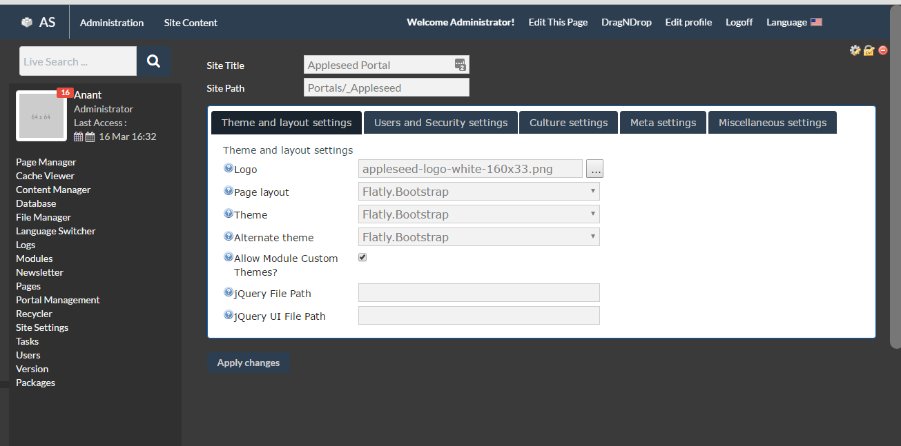
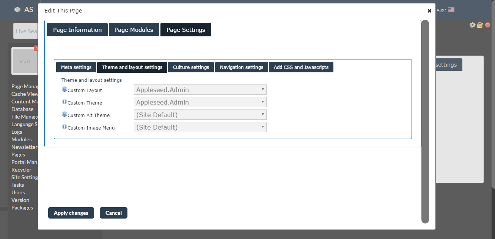

=============================
Theme / Layout Designer Guide
=============================

Overview
--------
The files for updating the design of an Appleseed site are located in the /Design folder of the site. 

Making a Layout
---------------
The files for editing or creating a layout are located in the /Design/DesktopLayouts/*Theme_Name*/ folder.
Each layout should have it own uniquely named folder within this folder to match the name of the theme. 
This folder will include **.ascx** (ASP.NET control) and **.master** (ASP.NET master) files, which are basically HTML files to which C# and ASP.NET code can be added for functionality. They will have some code in <% … %> tags which should generally left to developers. When creating a new Appleseed theme, these files can be borrowed from an existing theme and edited. 

A basic layout should have the following files :

- DesktopAdmin.ascx - Sets up the layout of the Admin Bar that appears when an Admin user is logged in. This file should generally remain as it is when pulled from an existing theme as the Appleseed Admin Bar should remain constant.
- DesktopPortalBanner.ascx - Sets up the layout of the Header section of the site including the logo and top menu. The existing them should have elements and code for the site logo and title, which should remain, so the user can add their own logo and/or title throught the Appleseed Portal interface which will look something like this: 
    ``<a class="navbar-brand" href="/1">``
      ``<!-- Portal Logo Image Uploaded-->``
        ``<rbfwebui:headerimage id="PortalImage" … />``
      ``<!-- End Portal Logo-->``
      ``<!-- Portal Title -->``
        ``<rbfwebui:headertitle id="PortalTitle" … ></rbfwebui:headertitle>``
      ``<!-- End Portal Title -->``
    ``</a>``
  There should also be similar code for the Portal Menu which should remain, which will look something like this:
    ``<!-- Begin Portal Menu →``
      ``<asp:Menu … >``
      ``</asp:Menu>``
    ``<!-- End Portal Menu -->``
  Other elements can be added around these as necessary for the new theme. 
- DesktopFooter.ascx - Optionally sets up the layout of the Footer section. Fat Footer Layout that may be edited by the admin user should be put in an HTML module in the Bottom Pane of the site.
- PanesMaster.master - Sets up the layout of the default Panes section of the site. Bootstrap classes should be added the 
 elements as necessary.
- SiteMaster.master - Sets up the Head section of the HTML document, and the general layout, including the <body> element and the wrapping <form> element, if Web Forms is being used. Javascript files can be registered at the top of the file. Bootstrap classes should be added to the 
 elements as necessary.

An alternate or child layout can be set up with just one file:

- PanesMaster.ascx 

The C# code at the top of this file should point back to the parent theme.
<%@ Master Language="C#" MasterPageFile="~/Design/DesktopLayouts/*Parent_Theme_Name*/SiteMaster.master" 
AutoEventWireup="true" %>

Making a Theme
--------------
The files for editing or creating a theme are located in the /Design/Themes/*Theme_Name*/ folder:

- Theme.xml - required, generally no need to change. 
- default.css - basic CSS required for Appleseed
- as-admin-bar.css - CSS for the Admin Bar
- jquery-ui-1.9.2.custom.css - CSS for dialog boxes and other UI elements

CSS files specific to the theme should be in a subfolder like this: /Design/Themes/*Theme_Name*/css. These files can then be referenced by <link> elements in the Sit

All themes should be responsive, and responsive design should be handled by the latest Bootstrap.css files. 

Menu Design should be handled by the main theme CSS file or files. 

Other folders can be set up in the /Design/DesktopLayouts/*Theme_Name*/ such as:
	/js - to hold javascript files used by the theme. jQuery and jQueryUI are alread set up in Appleseed, so they should not be referenced here. 
	/images/ - to hold images used by the theme.Images that are not specific to the theme can be placed in the /Portals/_Appleseed/images/*Theme_Name*/ folder.

Setting/Switching Global Themes / Layouts
-----------------------
Global Layouts and Themes for the whole site can be set or switched on the Site Settings page from the **Site Manager** dropdown in the top Admin Menu. Under the **Theme and layout setting**” tab, there are fields for **Page Layout** and **Theme** with dropdown menu arrows on the right, so you can choose from those available.

Page Themes / Layouts
---------------------
Individual pages can also be set to a layout or theme different from those of the Site default. 
For example one or more pages may wish to have a different panes layout from that of the Home page. Setting up such a child layout has been described above. The layout or theme for a page can be changed by clicking on the **Edit This Page** button in the top Admin Menu, then selecting the **Page Settings** tab. Similar to above, under the **Theme and layout setting**” tab, there are fields for **Custom Layout** and ** Custom Theme** with dropdown menu arrows on the right, so you can choose from those available. 

