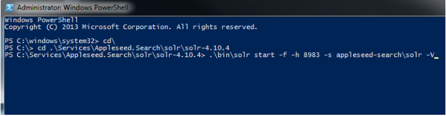
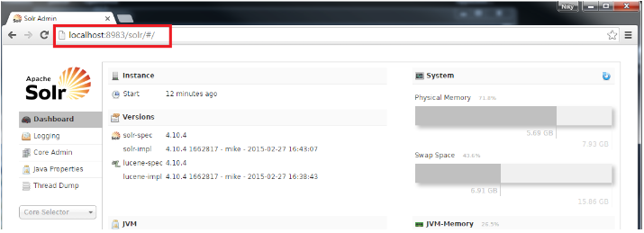
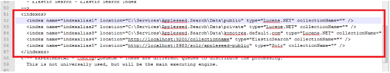

Appleseed Search Server Installation
=============================

Setting up Solr on a Client Server
-------------

Main Root for Admin Documentation for Appleseed Search

* Use Remote Desktop Connection to connect to the client's Indexing Server.
* Install Java JRE (newest) on this server if it's not already there.
* Export the Services/Appleseed.Search folder from an internal source into the C:\Services\Appleseed.Search directory of the site.

.. image:: ../images/First-Step.PNG

* Export and Unzip/Extract the latest IndexService zp file from the Binaries/Appleseed.Serach folder from an internal source into the C:\Services\Appleseed.Search\Index.Service directory created earlier.

.. image:: ../images/Second-Step.PNG

* Export and Unzip/Extract the solr-4.10.4.zip (or latest 4.x) file from the External/Software folder from the External/Software folder into the C:\Services\Appleseed.Search\Index.Service directory created earlier.

.. image:: ../images/Third-Step.PNG

* Copy the Appleseed Search Solr Configuration directory

   * Copy.the \solr\solr-4.10.4\anant\appleseed-search directory into the.\solr\solr-4.10.4\example directory of the site.

.. image:: ../images/Fourth-Step.PNG

* Start the Solr Service. 

    * Open Windows PowerShell and run as administrator. Start Solr by inputting this script: bin\solr start -f -h 8983 -s appleseed-search\solr -V. 
    * Make sure you are in the C:\Services\Appleseed.Search\solr\solr-4.10.4 directory when you run it.

* Verify Appleseed public and private are on the Solr server.

    * Open a browser on the server and got to localhost:8983/solr, and check that it brings up the Solr Admin panel. 

    * If there is an error. check the C:\Services\Appleseed.Search\solr\solr-4.10.4\example\appleseed-search\solr\appleseed-public\data\index folder, and delete any write.lock file if there is one.

* Configure or merge index service configuration (XML file) to point to the SolR Endpoint  (indexalias) (http:/localhost:8983/solr).

    * C:\Services\Appleseed.Search\Index.Service\Appleseed.Services.Search.Console.exe.config (XML FILE)

