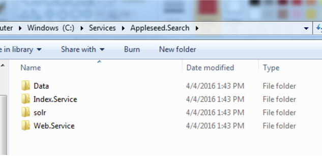
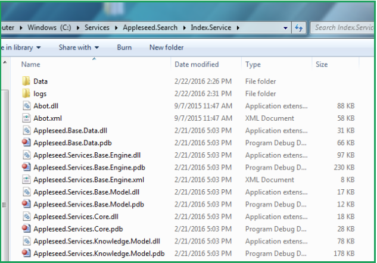
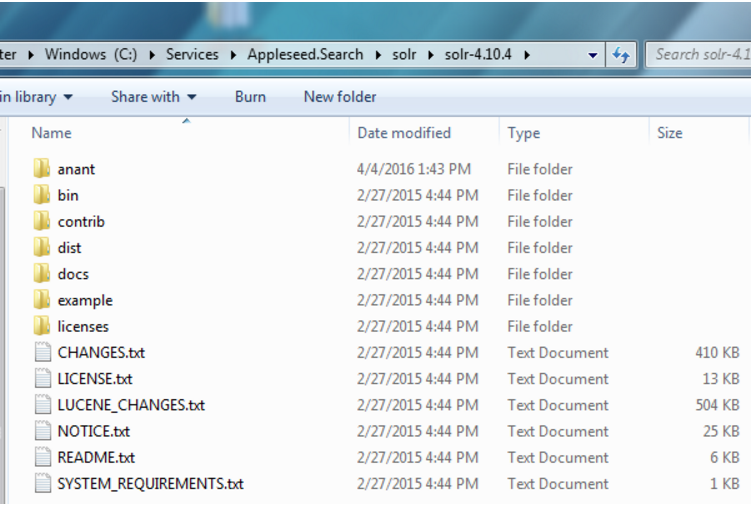
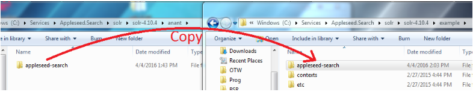

Appleseed Search Server Installation
=============================

Setting up Solr on a Client Server
-------------

Main Root for Admin Documentation for Appleseed Search

* Use Remote Desktop Connection to connect to the client's Indexing Server.
* Install Java JRE (newest) on this server if it's not already there.
* Export the Services/Appleseed.Search folder from an internal source into the C:\Services\Appleseed.Search directory of the site.

* Export and Unzip/Extract the latest IndexService zp file from the Binaries/Appleseed.Serach folder from an internal source into the C:\Services\Appleseed.Search\Index.Service directory created earlier.

* Export and Unzip/Extract the solr-4.10.4.zip (or latest 4.x) file from the External/Software folder from the External/Software folder into the C:\Services\Appleseed.Search\Index.Service directory created earlier.

* Copy the Appleseed Search Solr Configuration directory
   * Copy.the \solr\solr-4.10.4\anant\appleseed-search directory into the.\solr\solr-4.10.4\example directory of the site.

