.. toctree::
   :titlesonly:

=============================
Appleseed Search Installation
=============================

.. contents:: Table of Contents

Appleseed Search Server for Solr Endpoint Alias 
-------------

This section explains how to configure Appleseed Search for a Solr 4 or Solr 5 Endpoint

* Use Remote Desktop Connection to connect to the client's Search Server.
* Install Java JRE (newest) on this server if it's not already there.
* Solr4 & Solr5 are supported.  The below example uses Solr4.  Solr6 support is in development.
* Export the ``Services/Appleseed.Search`` folder from an internal source into the ``C:\Services\Appleseed.Search`` directory of the site.

.. image:: ../images/First-Step.PNG

* Export and Extract the latest IndexService.zip file from the ``Binaries/Appleseed.Serach`` folder from an internal source into the ``C:\Services\Appleseed.Search\Index.Service`` directory created earlier.

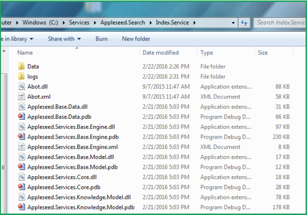

* Export and Extract your chosen Solr Verson ( 4 or 5 ) file from the Apache Mirror http://lucene.apache.org/solr/mirrors-solr-latest-redir.html into the ``C:\Services\Appleseed.Search\solr\<solr_install_directory>`` directory created earlier.

.. image:: ../images/Third-Step.PNG

* Copy the Appleseed Search Solr Configuration directory

   * Copy.the ``\solr\solr-4.10.4\anant\appleseed-search`` directory into the ``.\solr\solr_install_directory\example`` directory of the Solr installation.

.. image:: ../images/Fourth-Step.PNG

* Start the Solr Service. 

    * Open Windows PowerShell and run as administrator. Start Solr by inputting this script: ``bin\solr start -f -p 8983 -s example\appleseed-search\solr -V``. 
    * Make sure you are in the ``C:\Services\Appleseed.Search\solr\<solr_install_directory>`` directory when you run it.

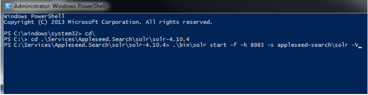

* (Windows Only) Install Solr as a service on the Server using PowerShell run as Administrator.
	
	* Install NSSM using chocolatey 
	* Command to enter into PowerShell: 
	* cinst nssm
	* Install service with NSSM: ``nssm install <Title of Service> (i.e nssm install Solr5)``
	* In the first panel that come up input the following 3 items:
	* ``Path : C:\Services\Appleseed.Search\solr\solr_install_directory\bin\solr.cmd``
	* ``Startup Directory : C:\Services\Appleseed.Search\solr\<solr_install_directory>``
	* ``Arguments: start -f -p 8983 -s appleseed-search\solr -V``
	* Click on the Details tab and enter these items:
	* ``Display Name : Solr ( Version Number )``
	* ``Description: Appleseed Search - Solr ( Version Number )``
	* Make sure the Startup Type is set to Automatic.
	* Click on the Install Service button toward the lower right. 
	* If you need to edit the info above after the service is installed the command is: ``nssm edit <Title of Service>``
	* Go to Control Panel => Administrative Tools and click on the Services shortcut.
	* Scroll down to the name of the service ``(“<Title of Service> (i.e Solr5)”)``, double click on it and Start it. 

* Verify Appleseed public and private are on the Solr server.

    * Open a browser on the server and go to localhost:8983/solr, and check that it brings up the Solr Admin panel. 

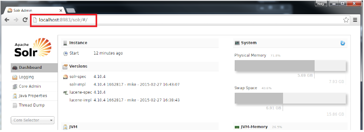

    * If there is an error, check the ``C:\Services\Appleseed.Search\solr\solr-4.10.4\example\appleseed-search\solr\appleseed-public\data\index`` folder, and delete any write.lock file if there is one.

* Configure or merge index service configuration (XML file) to point to the SolR Endpoint  (indexalias) (http:/localhost:8983/solr).

    * ``C:\Services\Appleseed.Search\Index.Service\Appleseed.Services.Search.Console.exe.config`` (XML FILE)

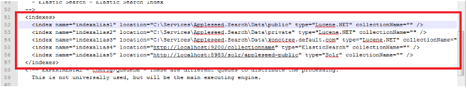

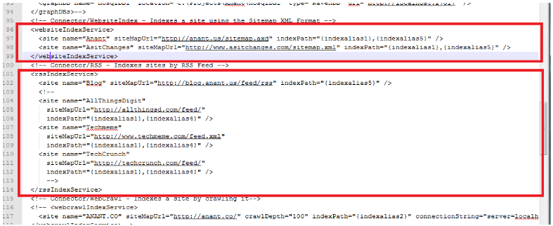

* Run the Index Service by double-clicking/clicking on it. ``(C:\Services\Appleseed.Search\Index.Service\Appleseed.Services.Search.Console.exe)``

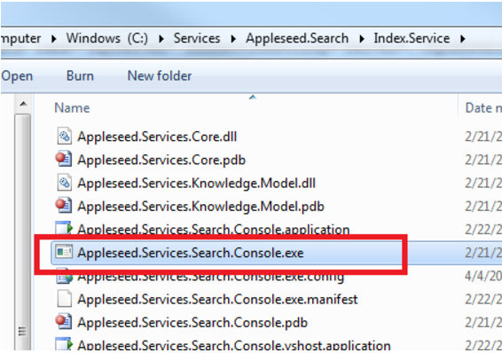

* Verify the data imported by open a browser and go to ``http://localhost:8983/solr`` to access the Solr app panel.

    * From the Index Selector dropdown in the left sidebar, select the appleseed-public collection, click on the Query tab, make sure *:* is in the “q” window, and click the Execute Query button. Check that “numFound” under “response” gives you the number you expect.

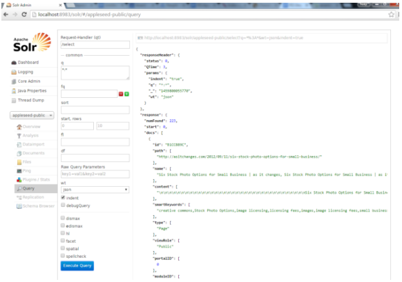

* To reindex the data to point to a different set: 
	1. Update the ``C:\Services\Appleseed.Search\Index.Service\Appleseed.Services.Search.Console.exe.config`` (XML FILE) as necessary.
	
		* Add or update index aliases between the <indexes> tags
		
		.. image:: ../images/Seventh-Step.PNG	
	
		* Add or edit sites between the <websiteIndexService> or <rssIndexService> tags when updating website or RSS feed sources, respectively.  You may also wish to edit the aliases used for each site by updating the indexPath attribute.  You may use more than one alias per site to get multiple search endpoints.
		
		.. image:: ../images/Eighth-Step.PNG

	2. In the Solr panel left sidebar, click on the Documents tab. 
	3. Set the Document Type to XML. 
	4. Enter in the “Document(s)” field “<delete><query>*:*</query></delete><commit/>” and click Submit Document.
	
	.. image:: ../images/Ten-Point-Five-Step.PNG
	
	* Alternative to step 4: 
		* Open a browser and enter into the URL bar: 
				“http://localhost:8983/solr/appleseed-public/update?stream.body=<delete><query>*:*</query></delete>” and hit enter.
		* Once a success message is returned enter into the URL bar: 
				“http://localhost:8983/solr/appleseed-public/update?stream.body=<commit/>”.

	
	5. Click on the Query tab and run a “*:*” query to check that the numfound is 0. 
	6. Run the Index Service again by double-clicking/clicking on it **as an admin** or you might get file permission issues.  This file should be ran in Powershell if available rather than simply double clicked on. ``(C:\Services\Appleseed.Search\Index.Service\Appleseed.Services.Search.Console.exe)``.

	* Alternative to step 6, you may use Luke instead of Solr.
		After downloading Luke from https://github.com/DmitryKey/luke/releases/tag/luke-4.10.4, Run luke.sh to open the apps. Direct Path directory the location of index files ``C:\Services\Appleseed.Search\Data\Public`` and hit OK.
	
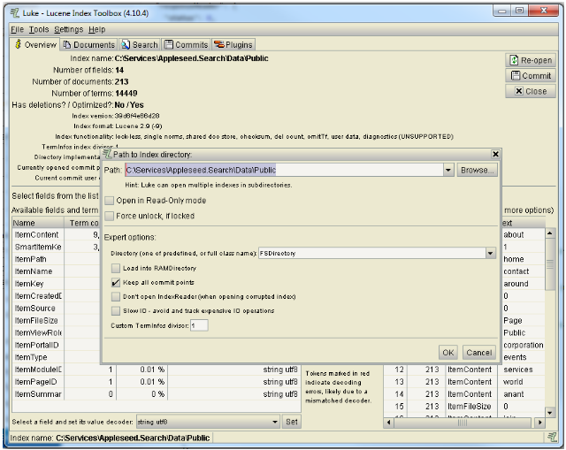

* Set up windows task scheduler to Run Index

    * Open Server Manager > Configuration > Task Scheduler >  Create Basic Task…

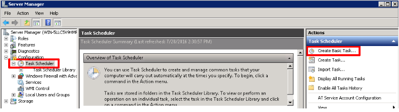

    * Fill it with neccesary info as follows.
    
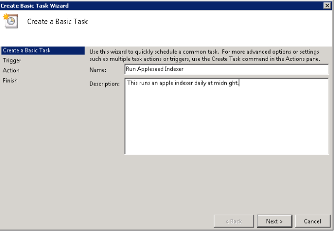

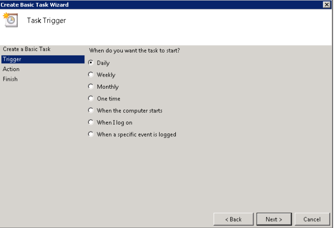

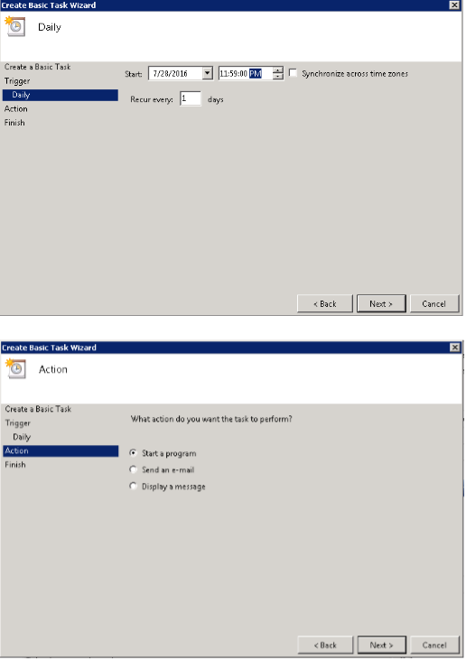

.. image:: ../images/Sixteenth-Step.PNG

* Set up Windows Search Web Server.

    * Install URL Redirect 2.0 from Microsoft
    
    * Create a Thin Microsoft.NET Web Site & Application pool in IIS and configure the web.config as follows ::

	<?xml version="1.0" encoding="UTF-8"?>
	<configuration>
	  <system.webServer>
             <rewrite>
		<rules>
		   <rule name="ReverseProxyInboundRule1" stopProcessing="true">
		    <match url="^solr/select(.*)" />
	            <action type="Rewrite" url="http://localhost:8983/solr/appleseed-public/select{R:1}" />
		    </rule>
		 </rules>
              </rewrite>
	  </system.webServer>
	</configuration>

* Install latest Angular.js interface (Search.Web.User.Ng/app) on the Indexing Server (http:/api.domain-name.com/app). 
* Start Solr proxy on IIS. 
* Test API with Angular.js interface. 
* Clean up old data from Solr.
* Configure the ``Search.Web.User.Ng\app\js\solr-ajax\app\documents.js`` file to point to the Reverse Proxy (http://api.domain-name.com/solr/).
* Verify data on Solr. 
* Verify data on Angular.js interface.

Appleseed Search Web User Installation and Customization on Appleseed Portal.
-------------

This section explains how to combine the Appleseed Portal and Search products.  Appleseed Portal is used as a Front End to the Appleseed Search product.

If you have not already installed Appleseed Portal, refer to the instructions here  `<http://learn.appleseedapp.net/en/latest/docs/Portal/install/#quick-install>`_

* Steps to set up Angular Search Interface on an Appleseed Site.

   * Open a code editor (such as Visual Studio 2015, or another compatible version).
   * Go to the folder in which you installed Appleseed 
   
     * Navigate to ``...\Appleseed\Design\DesktopLayouts\[Theme used]\DesktopPortalBanner.ascx``
     * Make sure you choose the file in the folder for the theme used not the one directly in the ``.\Appleseed\Design\DesktopLayouts\`` folder
     * add the Following script:
	 
		::
     
			// Add attributes to html element for Angular Search
	   
			$("html").attr({

			  "xmlns":"http://angularjs.org",
			  
			  "id":"ng-app",
			  
			  "ng-app":"solr-ajax"
			  
			});

		.. image:: ../images/Script-Update.PNG

     * Verify that the script is working.
     
       * Navigate to the Appleseed portal page.
       * Right click and click inspect elements. 
       * Check if the code has been added to the <html> element

        .. image:: ../images/Script-Verification.PNG

   * CSS Folder

     * Create a folder called "CSS" in the ``...Design\Themes\[Theme Used]\`` folder
     * Add the as-search.css file which can be found in the /Portals/_Appleseed/Search.Web.User.Ng/app/css/appleseed/ folder

   * Updating css file

     * Add the @import rules below to the bottom of the @import rules located at the top of the default.css file in the ``\Design\Themes\[Theme used]\`` folder: 

		::	 
	 
			@import url(/Portals/_Appleseed/Search.Web.User.Ng/app/css/bootstrap/bootstrap.min.css

			@import url(/Portals/_Appleseed/Search.Web.User.Ng/app/css/bootstrap/bootstrap-responsive.min.css);

			@import url(bootstrap.css);

			@import url(as-admin-bar.css);

			@import url(/Portals/_Appleseed/Search.Web.User.Ng/app/css/solr-ajax/screen.css);

			@import url(/Portals/_Appleseed/Search.Web.User.Ng/app/css/solr-ajax/facp.css);

			@import url(/Portals/_Appleseed/Search.Web.User.Ng/app/datepicker/css/datepicker.css);

			@import url(css/as-search.css);

       .. image:: ../images/Import-Rules.PNG

     * Copy the Angular and other script references listed below to the location beneath the </footer> element in the SiteMaster.master in the ``\Design\DesktopLayouts\[Theme_used]`` folder 
	 
		::	 
	 
			

			<!-- scripts - chosen -->

			

			

			<!-- angular scripts -->

			

			

			

			

			

			

			

			<!---->

			<!---->

			

			

			

			

			

			

			

			

			

			

			

			

			

			

			

			<!-- /angular scripts -->

			

			
		
    * Setting up Search on the Appleseed Site.
   
       * Login as admin. 
       * Click on the Site Manager(or Administration) tab on the left side of the	Admin Bar at the top. 
       *	Under Add New Page
   
         * Select a Page Parent (or leave as default if this page should be on the Root Level.) 
         * Select the roles that can see the page under Page Visible To:
         * Add a Page Title, such as Search.
         * Click the Add New Page button. 
         * Navigate to the new page. 

     * On this page, 
   
       * Click the Edit this Page link in the Admin Bar.
       * Click the Page Modules tab. 
       * Set up an HTML Module or Modules for the Angular search section or sections.to be used on this page.

     * Add the Module code. 
    
       * Click on Edit icon for the Module created
       * Switch to Source if the editor is in visual mode, and paste in the contents of the search-module.html file in the /Portals/_Appleseed/Search.Web.User.Ng/app/ folder. 

Update styling as necessary in the as-search.css file added to the ``\Design\Themes\[Theme used]\css`` folder.

.. include:: /././common.txt

