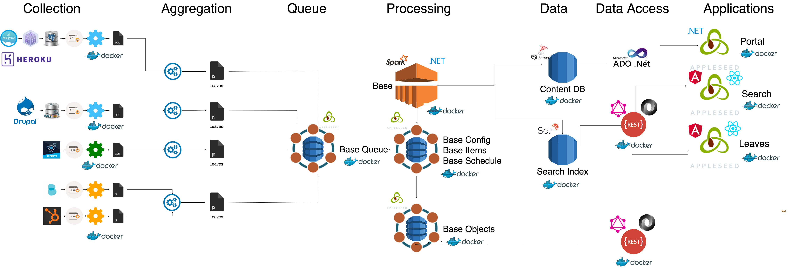

Welcome to the Appleseed Framework Documentation Site
=======================================================

.. note ::
  This site is a work in progress. Topics marked with a  |stub-icon|  are placeholders that are currently being written. You can track the status of these topics through our public documentation `issue tracker <https://github.com/appleseed/learn/issues>`_.

`Appleseed <https://www.github.com/Appleseed/>`_ is an open source Framework focused on providing an easy to use, high-performance, and reusable platform to build powerful web applications. The software gives designers, developers, and entrepreneurs a singular system to run the modern enterprise on Microsoft ASP.NET and Windows platforms.

This documentation is for Users, Builders, Designers, Developers, and Administrators of Appleseed.  The Project Owner,  `Anant Corporation <https://www.anant.us>`_ , also offers portal cloud services and subscriptions.

.. toctree::
    :titlesonly:
   
  docs/portal/index.rst
  docs/search/index.rst
  docs/developer/index.rst

.. include:: common.txt
